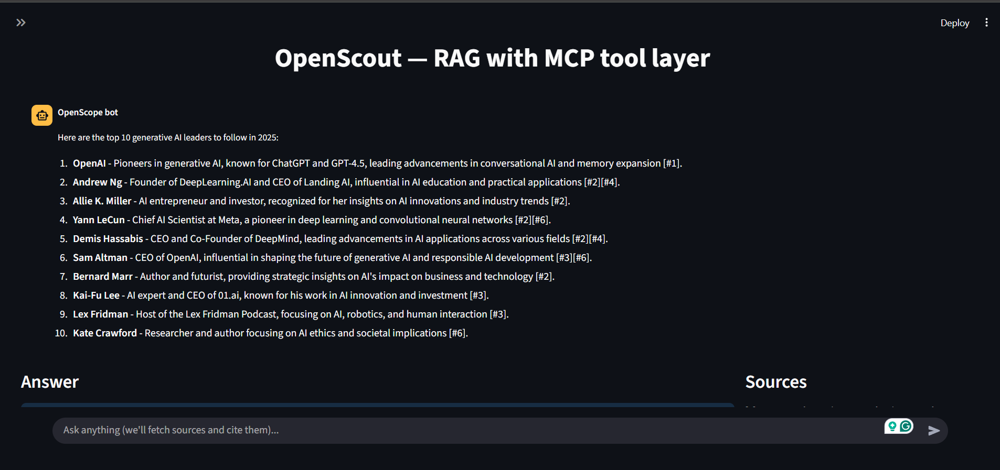

# OpenScout

OpenScout is a developer-focused Retrieval-Augmented Generation (RAG) [Perplexity Type Architecture] With MCP Integration application using Neo4j.

It answers natural-language questions by searching the web, fetching and extracting page content, chunking and embedding passages, storing vectors in FAISS, retrieving the most relevant passages, reranking them, and synthesizing a concise, cited answer using a pluggable LLM adapter.

---

## Architecture

High-level components and runtime flow:

- UI (Streamlit) — accepts user queries, handles API keys (BYOK) in the sidebar, and displays chat-style answers and sources.
- MCP layer (`core/mcp`) — optional: when configured, the app calls a central MCP server for search/extract/cypher; otherwise it falls back to local SDKs (Tavily/Neo4j).
- Graph pipeline (`core/graph.py`) — orchestrates nodes: search → fetch → index → retrieve. It returns retrieved hits for synthesis.
- Fetcher (`core/fetch.py`) — downloads pages and extracts text (httpx + trafilatura).
- Chunking + Embeddings (`core/chunk.py`, `core/embed.py`) — split text into passages and compute embeddings (OpenAI by default).
- Vector store (`core/faiss_store.py`) — FAISS index (IndexIDMap + IndexFlatIP) + SQLite metadata for passages.
- Reranker (`core/rerank.py`) — optional cross-encoder for higher precision.
- Synthesizer (`core/synthesize.py`) — builds the prompt from top passages and calls the selected LLM adapter (supports streaming when available).

Runtime flow: user query → search (MCP or Tavily) → fetch pages → chunk & embed → index/store → retrieve top passages → (rerank) → LLM synthesize → UI.


## Files

Key files and their purposes:

- `app.py` — Streamlit entrypoint; UI, BYOK handling, per-provider key tests, chat history, and orchestration of the graph.
- `core/graph.py` — LangGraph state graph wiring the main pipeline nodes (search, fetch, index, retrieve) and binding the synthesizer.
- `core/mcp/adapters.py` — MCPTools adapter: calls a remote MCP server when configured (`MCP_URL`) or falls back to local SDKs (Tavily/Neo4j).
- `core/search.py` — Local Tavily search wrapper with clearer error messages.
- `core/fetch.py` — Async fetcher using httpx and content extraction via trafilatura.
- `core/chunk.py` — Text chunking logic for splitting pages into passage-sized chunks.
- `core/embed.py` — OpenAI embedding wrapper (accepts explicit key or uses `OPENAI_API_KEY` env fallback).
- `core/faiss_store.py` — FAISS index management (creates/wraps IndexIDMap) and SQLite metadata storage for chunks.
- `core/rerank.py` — Cross-encoder-based reranker using sentence-transformers (optional).
- `core/llm/` — LLM adapters and registry (`openai_llm.py`, `anthropic_llm.py`, `gemini_llm.py`, `groq_llm.py`, `registry.py`).
- `core/synthesize.py` — Builds the prompt from retrieved passages and performs synthesis via the LLM adapter.

---

## Screenshots

UI screenshots from a sample run (click to view full size):

- Main chat + answer view

	

- Sources Panel

	

- Side Panel

    
 
---

## How to use this

Quick steps to run OpenScout locally (PowerShell commands). These instructions assume you have Python 3.10+ installed.

Tip: For interactive local use, paste your LLM and provider API keys into the Streamlit sidebar when the app runs — this keeps secrets out of your repo. Creating a `.env` is optional and only recommended for persistent local defaults or CI.

1. Clone or download the repository:

```powershell
git clone <your-repo-url> OpenScout
cd OpenScout
```

2. Create and activate a virtual environment, then install dependencies. If you already have a `requirements.txt` use it; otherwise create one from your environment.

```powershell
python -m venv .venv
.\.venv\Scripts\Activate.ps1
pip install -r requirements.txt
```

3. Obtain credentials:
- Neo4j: URI, username, and password (if you plan to use Neo4j for graph/cypher operations).
- Tavily: `TAVILY_API_KEY` for web search/enrichment (or configure MCP server instead).
- LLM provider key: one of `OPENAI_API_KEY`, `GROQ_API_KEY`, `ANTHROPIC_API_KEY`, or `GOOGLE_API_KEY` (Gemini).

4. Create a `.env` file in the project root with the credentials (example) — OR, for interactive use, paste keys into the Streamlit sidebar fields at runtime (preferred for local testing). The sidebar stores keys in-session; `.env` is optional and mainly useful for CI or when you want persistent local defaults.

```text
TAVILY_API_KEY=sk_tavily_...
NEO4J_URI=bolt://localhost:7687
NEO4J_USERNAME=neo4j
NEO4J_PASSWORD=yourpassword
OPENAI_API_KEY=sk-...      # or GROQ_API_KEY=grq-... , ANTHROPIC_API_KEY=..., GOOGLE_API_KEY=...
# Optional: MCP_URL and MCP_API_KEY if using a remote MCP server
# MCP_URL=https://your-mcp.server
# MCP_API_KEY=...
```

5. Start the Streamlit app:

```powershell
streamlit run .\app.py
```

6. In the app sidebar:
- Paste any missing keys into the corresponding fields (they will be stored in-session).
- Optionally click the per-provider "Test key" buttons to validate connectivity.

7. Ask a question in the chat input. The app will search, fetch pages, index passages, and synthesize a cited answer.

Notes and troubleshooting:
- If you see import errors for packages like `faiss`, `torch`, or `tavily`, install the correct OS-specific wheels or use `faiss-cpu` for most local dev setups.
- If FAISS index load fails due to index type, delete the existing `faiss_index.bin` to allow rebuild, or run a migration script (not included).
- Keep secrets out of commits: ensure `.env` is in `.gitignore`.


